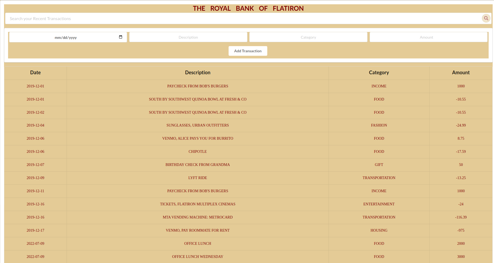

# Bank of Flatiron

You can access this project through <a href='https://63c6729ad56a9b0008b91249--willowy-kringle-0ed0cf.netlify.app/'>Bank of flatiron</a>

## Instructions

For this project, you’ll be building out a React application that displays a 
list of your recent bank transactions, among other features.

Part of what this code challenge is testing is your ability to follow given
instructions. While you will definitely have a significant amount of freedom in
how you implement the features, be sure to carefully read the directions for
setting up the application.

## Setup

1. Clone the repository

To clone the repository run git clone from your terminal,use this link
    
        git@github.com:ErnestH1/Bank-of-Flatiron.git

2. After cloning navigate to the cloned repository using 

            cd Bank-of-Flatiron

3. In a new terminal, run `npm start`. This will run your React app on port `3000`.

The JSON data is hosted remotely on (https://api.npoint.io/3dd77f4c5b2c04fd1041/transactions/)

After starting up the appplication it should look like this
   

## Preview

## Core Deliverables

As a user, I should be able to:

- See a table of the transactions.
- Fill out and submit the form to add a new transaction. This should add the new
  transaction to the table **as well as post the new transaction to the backend
  API for persistence**.
- Filter transactions by typing into the search bar. Only transactions with a
  description matching the search term should be shown in the transactions
  table.
   

Author <a href="https://github.com/ErnestH1/Bank-of-Flatiron">Ernest H</a> 

License MIT

